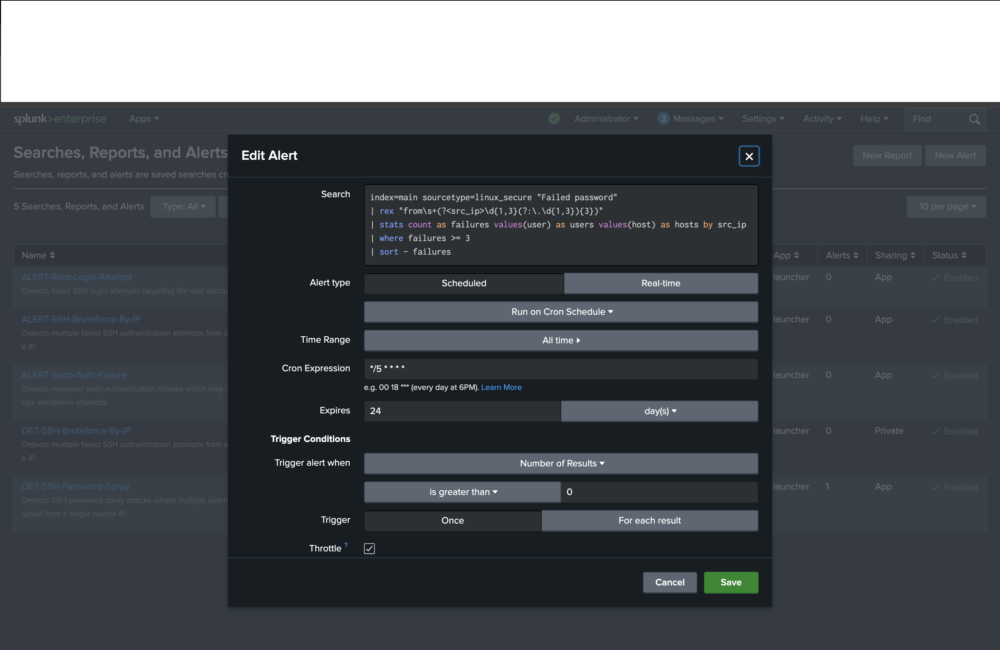
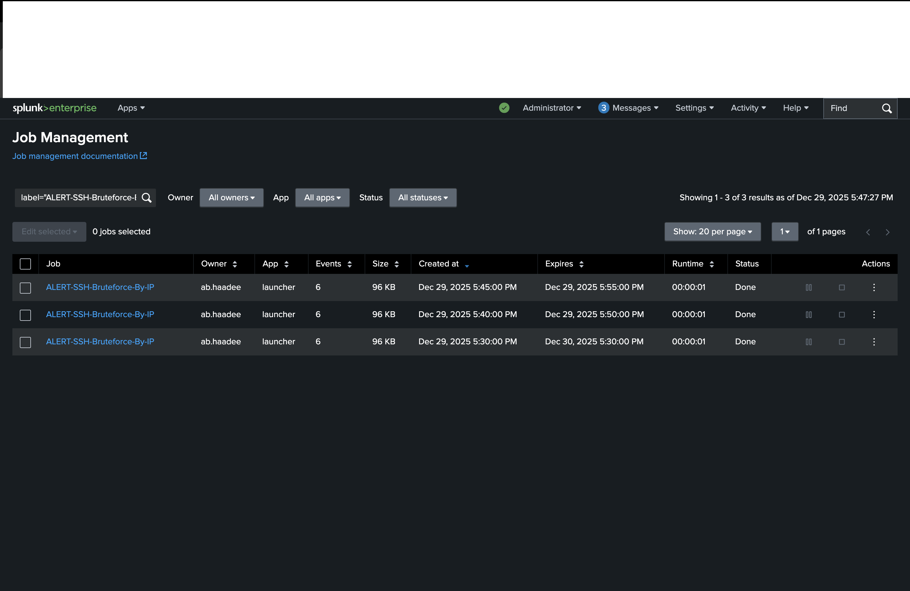
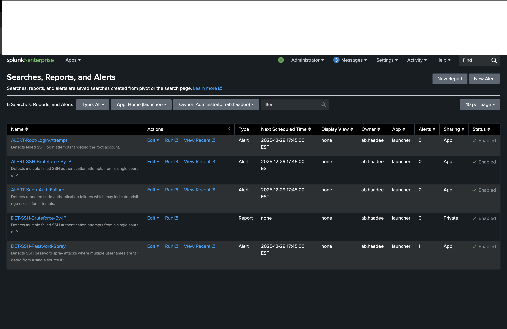

# Splunk Security Monitoring & Alerting Lab

## Project Overview
This project demonstrates hands-on security monitoring and alerting using **Splunk Enterprise**.  
Linux authentication logs were ingested and analyzed to detect common attack patterns such as:

- SSH brute-force attacks  
- SSH password spray attempts  
- Root login attempts  
- Failed sudo authentication attempts  

Custom SPL searches were developed and converted into **scheduled alerts**, simulating real-world SOC detection workflows.

## Tools & Technologies
- Splunk Enterprise (Trial)
- SPL (Search Processing Language)
- Linux authentication logs (`/var/log/auth.log`)
- macOS lab environment
- Git & GitHub

## Detection Logic Overview

| Detection Name | Description |
|---------------|------------|
| DET-SSH-Bruteforce-By-IP | Multiple failed SSH logins from a single source IP |
| DET-SSH-Password-Spray | One IP attempting many different user accounts |
| DET-Root-Login-Attempt | Failed login attempts targeting the `root` account |
| DET-Sudo-Auth-Failure | Failed sudo authentication attempts |

## Detection Screenshots

### DET-SSH-Bruteforce-By-IP
Detects multiple failed SSH authentication attempts originating from a single source IP, indicating a potential brute-force attack.

### DET-SSH-Password-Spray
Detects a single source IP attempting authentication against multiple distinct user accounts, which is characteristic of a password spray attack.

### DET-Root-Login-Attempt
Detects failed authentication attempts targeting the `root` account, which is considered high-risk activity.

### DET-Sudo-Auth-Failure
Detects failed sudo authentication attempts that may indicate privilege escalation attempts or user error.

## Alert Configuration

Each detection was saved as a **scheduled Splunk alert** with throttling enabled to prevent alert fatigue.

### SSH Bruteforce Alert Configuration
Shows the alert configuration used for detecting SSH brute-force activity.

### Alert Execution History
Demonstrates that the alert executed successfully and produced results.

### Alerts Overview
Overview of all configured alerts in Splunk.

## Key Takeaways
- Built SOC-style detections using SPL
- Converted searches into actionable alerts
- Implemented scheduling and throttling to reduce alert fatigue
- Demonstrated the full detection lifecycle: **logs → detection → alert → execution**

## Future Improvements
- Create dashboards for authentication trends
- Expand detections to Windows Event Logs
- Rebuild alerts using Infrastructure as Code (Terraform)
